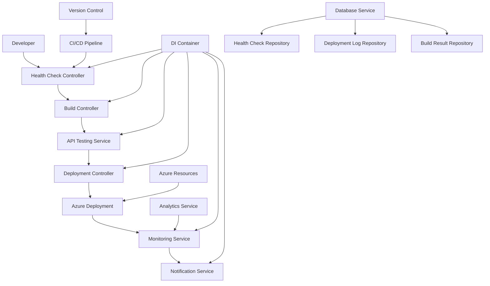
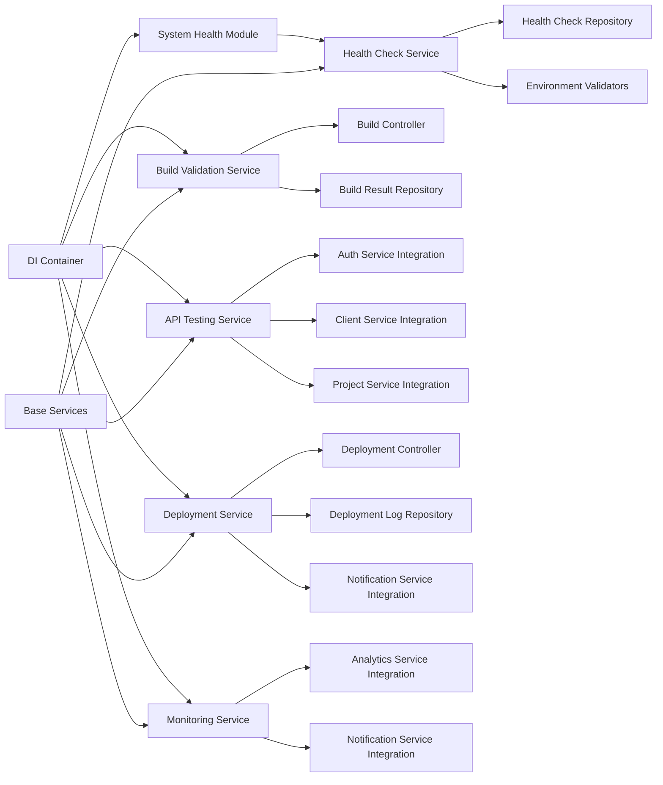

# System Health and Deployment Automation Design

## Overview

The System Health and Deployment Automation feature provides comprehensive automated validation, testing, and deployment capabilities for the Roastify freelance management platform. This system ensures reliable production deployments through systematic health checks, build validation, API testing, and automated deployment processes.

The solution consists of modular validation components, deployment orchestration tools, and monitoring systems that work together to provide a complete DevOps automation pipeline. The system supports both local development workflows and production CI/CD pipelines.

## Architecture

### High-Level Architecture (Modular Integration)



### Modular Component Architecture



## Components and Interfaces

### Module Structure Integration

The system health and deployment automation will be implemented as a dedicated module within the existing modular architecture:

```
backend/src/modules/system-health/
├── index.js                    # Module registration
├── controllers/
│   ├── HealthCheckController.js
│   ├── BuildController.js
│   └── DeploymentController.js
├── services/
│   ├── HealthCheckService.js
│   ├── BuildValidationService.js
│   ├── APITestingService.js
│   └── DeploymentService.js
├── repositories/
│   ├── HealthCheckRepository.js
│   └── DeploymentLogRepository.js
├── models/
│   ├── HealthCheckResult.js
│   ├── BuildResult.js
│   └── DeploymentConfig.js
└── validators/
    ├── environmentValidators.js
    └── configurationValidators.js
```

### 1. Health Check Service (Modular Architecture)

**Purpose**: Orchestrates comprehensive system validation checks within the DI container

**Interface**:
```javascript
class HealthCheckService {
  constructor(database, logger, config) {
    this.database = database;
    this.logger = logger;
    this.config = config;
  }

  async runSystemCheck(options = {})
  async validateFileStructure(requiredPaths)
  async checkEnvironmentConfig(environment)
  async validateDependencies(packagePath)
  async testDatabaseConnectivity()
  async validateSecurityConfig()
  generateHealthReport(results)
}
```

**DI Registration**:
```javascript
// In backend/src/modules/system-health/index.js
function registerSystemHealthModule(container) {
  // Register services
  container.register('healthCheckService', (c) => 
    new HealthCheckService(
      c.resolve('database'),
      c.resolve('logger'),
      c.resolve('config')
    )
  );
  
  // Register controllers
  container.register('healthCheckController', (c) =>
    new HealthCheckController(c.resolve('healthCheckService'))
  );
}
```

**Responsibilities**:
- Coordinate all validation components
- Integrate with existing database and logging services
- Aggregate validation results
- Generate comprehensive health reports
- Provide actionable error messages

### 2. Build Validation Service (Modular Architecture)

**Purpose**: Validates frontend build process and output within the service layer

**Interface**:
```javascript
class BuildValidationService extends BaseService {
  constructor(database, logger, config) {
    super(database, logger);
    this.config = config;
  }

  async cleanBuildArtifacts(buildPath)
  async validateBuildProcess(projectPath)
  async checkBuildOutput(distPath)
  async analyzeBundleSize(assets)
  async validateProductionReadiness(buildArtifacts)
  async saveBuildResult(buildResult)
  generateBuildReport(results)
}
```

**Controller Integration**:
```javascript
class BuildController extends BaseController {
  constructor(buildValidationService) {
    super();
    this.buildValidationService = buildValidationService;
  }

  async validateBuild(req, res) {
    try {
      const result = await this.buildValidationService.validateBuildProcess(req.body.projectPath);
      await this.buildValidationService.saveBuildResult(result);
      this.sendSuccess(res, result);
    } catch (error) {
      this.sendError(res, error);
    }
  }
}
```

**Responsibilities**:
- Clean previous build artifacts
- Validate build compilation
- Check output file integrity
- Analyze bundle size and performance
- Ensure production readiness
- Persist build results using repository pattern

### 3. API Testing Service (Modular Architecture)

**Purpose**: Comprehensive backend API validation using existing services

**Interface**:
```javascript
class APITestingService extends BaseService {
  constructor(database, logger, authService, clientService, projectService) {
    super(database, logger);
    this.authService = authService;
    this.clientService = clientService;
    this.projectService = projectService;
  }

  async testDatabaseConnectivity()
  async validateAuthenticationFlow()
  async testCoreEndpoints()
  async validateSecurityHeaders()
  async testErrorHandling()
  async saveTestResults(results)
  generateAPIReport(results)
}
```

**Service Integration**:
```javascript
// Leverages existing modular services for testing
async testCoreEndpoints() {
  const results = [];
  
  // Test clients module
  try {
    await this.clientService.findAll(testUserId);
    results.push({ module: 'clients', status: 'pass' });
  } catch (error) {
    results.push({ module: 'clients', status: 'fail', error: error.message });
  }
  
  // Test projects module
  try {
    await this.projectService.findAll(testUserId);
    results.push({ module: 'projects', status: 'pass' });
  } catch (error) {
    results.push({ module: 'projects', status: 'fail', error: error.message });
  }
  
  return results;
}
```

**Responsibilities**:
- Test all critical API endpoints using existing services
- Validate authentication through auth module
- Check security configurations
- Test error handling scenarios
- Generate API health reports
- Integrate with existing modular services

### 4. Deployment Service (Modular Architecture)

**Purpose**: Orchestrates deployment preparation and execution within the service layer

**Interface**:
```javascript
class DeploymentService extends BaseService {
  constructor(database, logger, config, notificationService) {
    super(database, logger);
    this.config = config;
    this.notificationService = notificationService;
  }

  async prepareDeployment(environment)
  async generateAzureConfig(envVars)
  async createDeploymentPackage()
  async deployToAzure(config)
  async validateDeployment()
  async rollbackDeployment(version)
  async logDeploymentEvent(event)
  async notifyDeploymentStatus(status)
}
```

**Repository Integration**:
```javascript
class DeploymentLogRepository extends BaseRepository {
  constructor(database) {
    super(database, 'deployment_logs');
  }

  async createDeploymentLog(deploymentData) {
    return await this.create(deploymentData);
  }

  async findDeploymentsByEnvironment(environment) {
    return await this.findMany({ environment });
  }

  async getLatestDeployment(environment) {
    return await this.queryOne(
      'SELECT * FROM deployment_logs WHERE environment = $1 ORDER BY created_at DESC LIMIT 1',
      [environment]
    );
  }
}
```

**Responsibilities**:
- Prepare deployment configurations
- Generate Azure resource scripts
- Create clean deployment packages
- Execute deployment to Azure
- Validate successful deployment
- Provide rollback capabilities
- Log deployment events using repository pattern
- Integrate with notification service for alerts

### 5. Monitoring Service (Modular Architecture)

**Purpose**: Continuous monitoring and alerting integrated with existing notification system

**Interface**:
```javascript
class MonitoringService extends BaseService {
  constructor(database, logger, config, notificationService, analyticsService) {
    super(database, logger);
    this.config = config;
    this.notificationService = notificationService;
    this.analyticsService = analyticsService;
  }

  async setupApplicationInsights(config)
  async monitorSystemHealth()
  async trackDeploymentMetrics(deploymentId)
  async generateAlerts(conditions)
  async createDashboards()
  async saveMonitoringData(data)
}
```

**Integration with Existing Services**:
```javascript
// Leverages existing analytics and notification services
async trackDeploymentMetrics(deploymentId) {
  const metrics = await this.collectSystemMetrics();
  
  // Use existing analytics service
  await this.analyticsService.trackEvent('deployment_metrics', {
    deploymentId,
    ...metrics
  });
  
  // Store in database using repository pattern
  await this.saveMonitoringData({
    deployment_id: deploymentId,
    metrics: JSON.stringify(metrics),
    timestamp: new Date()
  });
}

async generateAlerts(conditions) {
  for (const condition of conditions) {
    if (condition.triggered) {
      // Use existing notification service
      await this.notificationService.createSystemNotification({
        type: 'deployment_alert',
        title: condition.title,
        message: condition.message,
        severity: condition.severity
      });
    }
  }
}
```

**Responsibilities**:
- Integrate with Azure Application Insights through existing analytics service
- Monitor system performance and health
- Track deployment success metrics
- Generate alerts using existing notification system
- Create monitoring dashboards
- Store monitoring data using repository pattern

## API Endpoints (RESTful Integration)

The system health module will expose RESTful endpoints following the existing API patterns:

### Health Check Endpoints
```
GET    /api/system-health/check           # Run comprehensive health check
GET    /api/system-health/status          # Get current system status
POST   /api/system-health/validate        # Validate specific components
GET    /api/system-health/history         # Get health check history
```

### Build Validation Endpoints
```
POST   /api/system-health/build/validate  # Validate frontend build
GET    /api/system-health/build/status    # Get build status
GET    /api/system-health/build/history   # Get build history
POST   /api/system-health/build/clean     # Clean build artifacts
```

### Deployment Endpoints
```
POST   /api/system-health/deploy/prepare  # Prepare deployment
POST   /api/system-health/deploy/execute  # Execute deployment
GET    /api/system-health/deploy/status   # Get deployment status
POST   /api/system-health/deploy/rollback # Rollback deployment
GET    /api/system-health/deploy/logs     # Get deployment logs
```

### Controller Implementation Pattern
```javascript
// Following existing controller patterns
class HealthCheckController extends BaseController {
  constructor(healthCheckService) {
    super();
    this.healthCheckService = healthCheckService;
    this.setupRoutes();
  }

  setupRoutes() {
    this.router.get('/check', this.authenticateToken, this.runHealthCheck.bind(this));
    this.router.get('/status', this.authenticateToken, this.getStatus.bind(this));
    this.router.post('/validate', this.authenticateToken, this.validateComponents.bind(this));
    this.router.get('/history', this.authenticateToken, this.getHistory.bind(this));
  }

  async runHealthCheck(req, res) {
    try {
      const result = await this.healthCheckService.runSystemCheck(req.query);
      this.sendSuccess(res, result);
    } catch (error) {
      this.sendError(res, error);
    }
  }
}
```

## Data Models

### Health Check Result
```javascript
{
  timestamp: Date,
  environment: String,
  overallStatus: 'pass' | 'fail' | 'warning',
  checks: [
    {
      name: String,
      status: 'pass' | 'fail' | 'warning',
      message: String,
      details: Object,
      duration: Number
    }
  ],
  summary: {
    total: Number,
    passed: Number,
    failed: Number,
    warnings: Number
  }
}
```

### Build Validation Result
```javascript
{
  timestamp: Date,
  buildPath: String,
  status: 'success' | 'failure',
  assets: [
    {
      name: String,
      size: Number,
      type: String,
      optimized: Boolean
    }
  ],
  bundleSize: {
    total: Number,
    javascript: Number,
    css: Number,
    assets: Number
  },
  warnings: [String],
  errors: [String]
}
```

### Deployment Configuration
```javascript
{
  environment: 'development' | 'production',
  timestamp: Date,
  version: String,
  azure: {
    appServiceName: String,
    resourceGroup: String,
    environmentVariables: Object,
    connectionStrings: Object
  },
  frontend: {
    buildPath: String,
    staticWebAppConfig: Object
  },
  backend: {
    packagePath: String,
    startupCommand: String
  }
}
```

## Correctness Properties

*A property is a characteristic or behavior that should hold true across all valid executions of a system-essentially, a formal statement about what the system should do. Properties serve as the bridge between human-readable specifications and machine-verifiable correctness guarantees.*

### Property 1: System Health Check Consistency
*For any* system configuration, running health checks multiple times with the same inputs should produce consistent validation results
**Validates: Requirements 1.1, 1.2, 1.3, 1.4, 1.5**

### Property 2: Build Process Determinism
*For any* valid React application, the build process should produce the same output artifacts when run multiple times with identical source code
**Validates: Requirements 2.1, 2.2, 2.3**

### Property 3: Build Size Validation Accuracy
*For any* build output, size validation should correctly identify when bundle sizes exceed configured thresholds
**Validates: Requirements 2.4**

### Property 4: Production Build Cleanliness
*For any* production build, the output should contain no development-specific references or debugging code
**Validates: Requirements 2.5**

### Property 5: API Endpoint Testing Completeness
*For any* set of API endpoints, the testing engine should validate all CRUD operations and return consistent results for identical requests
**Validates: Requirements 3.1, 3.2, 3.3**

### Property 6: Security Validation Consistency
*For any* security configuration, validation should consistently identify missing or misconfigured security measures
**Validates: Requirements 3.4, 3.5**

### Property 7: Deployment Configuration Generation
*For any* valid environment specification, the deployment engine should generate complete and valid Azure configuration scripts
**Validates: Requirements 4.1, 4.2, 4.3, 4.4, 4.5**

### Property 8: Deployment Validation Reliability
*For any* successful deployment, post-deployment validation should consistently verify that all services are operational
**Validates: Requirements 5.1, 5.2, 5.3**

### Property 9: Error Reporting Completeness
*For any* system error or failure, the system should provide detailed error information and actionable troubleshooting guidance
**Validates: Requirements 5.4, 6.2**

### Property 10: Rollback Operation Safety
*For any* deployment rollback operation, the system should safely revert to the previous working state without data loss
**Validates: Requirements 5.5**

### Property 11: Logging Consistency
*For any* system operation, all activities should be logged with consistent timestamp and status information
**Validates: Requirements 6.1, 6.3**

### Property 12: Monitoring Integration Reliability
*For any* production deployment, monitoring integration should consistently collect and report telemetry data
**Validates: Requirements 6.4, 6.5**

### Property 13: Environment Configuration Isolation
*For any* environment switch, the system should apply the correct configuration without cross-environment contamination
**Validates: Requirements 7.1, 7.2, 7.3**

### Property 14: Credential Security Preservation
*For any* configuration containing sensitive data, the system should protect credentials and never expose them in logs or outputs
**Validates: Requirements 7.4**

### Property 15: CI/CD Pipeline Consistency
*For any* code change triggering deployment, the CI/CD pipeline should execute all validation steps in the correct order
**Validates: Requirements 8.1, 8.2, 8.3, 8.4, 8.5**

## Error Handling

### Validation Errors
- **File System Errors**: Missing files, permission issues, corrupted directories
- **Environment Errors**: Missing variables, invalid values, configuration conflicts
- **Dependency Errors**: Missing packages, version conflicts, installation failures
- **Database Errors**: Connection failures, schema mismatches, permission issues

### Build Errors
- **Compilation Errors**: Syntax errors, type errors, missing dependencies
- **Asset Errors**: Missing files, optimization failures, size limit exceeded
- **Configuration Errors**: Invalid build settings, missing environment variables

### Deployment Errors
- **Azure Errors**: Authentication failures, resource conflicts, quota exceeded
- **Network Errors**: Connection timeouts, DNS resolution failures
- **Configuration Errors**: Invalid environment variables, missing secrets

### Recovery Strategies
- **Automatic Retry**: For transient network and service errors
- **Graceful Degradation**: Continue with warnings for non-critical failures
- **Rollback Triggers**: Automatic rollback on critical deployment failures
- **Manual Intervention**: Clear guidance for errors requiring human action

## Testing Strategy

### Unit Testing Approach
- Test individual validation components in isolation
- Mock external dependencies (Azure services, databases)
- Verify error handling for various failure scenarios
- Test configuration parsing and validation logic

### Property-Based Testing Approach
- Use **fast-check** library for JavaScript property-based testing
- Configure each property test to run minimum 100 iterations
- Generate random system configurations to test validation consistency
- Test build processes with various project structures
- Validate deployment configurations across different environments

**Property-Based Testing Requirements**:
- Each correctness property must be implemented by a single property-based test
- Tests must be tagged with format: '**Feature: system-health-deployment, Property {number}: {property_text}**'
- Tests should generate diverse inputs to validate universal properties
- Edge cases should be handled through property test generators

### Integration Testing
- Test complete workflows from health check to deployment
- Validate Azure service integration with test environments
- Test CI/CD pipeline execution with sample repositories
- Verify monitoring and alerting integration

### Performance Testing
- Measure health check execution time across different system sizes
- Test build performance with various project complexities
- Validate deployment time for different application sizes
- Monitor resource usage during intensive operations